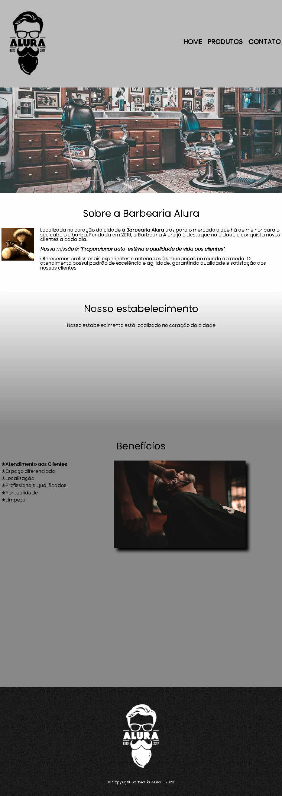

# Barbearia Alura - Praticando HTML e CSS

Projeto de construção de um site completo com três páginas, links externos, vídeos, mapa e navegação entre outras tags.

Conteudo:
  Diferença entre inline e block
  Criar formulários
  Campos para celulares
  Tabelas
  Hierarquia CSS
  Transformações e transições
  Importar conteúdo externo, como fontes, vídeos e mapas
  Pseudo-classes e pseudo-elementos
  Seletores de CSS avançados
  Opacidade e sombra
  Design responsivo e viewport

[🔗 Clique aqui para acessar](https://henriqueapereira.github.io/2-barbearia-alura/))

## 🛠️ Tecnologias

- HTML
- CSS
- Git & Github

📧 ## Contato
- henriqueadrianopereira@gmail.com

